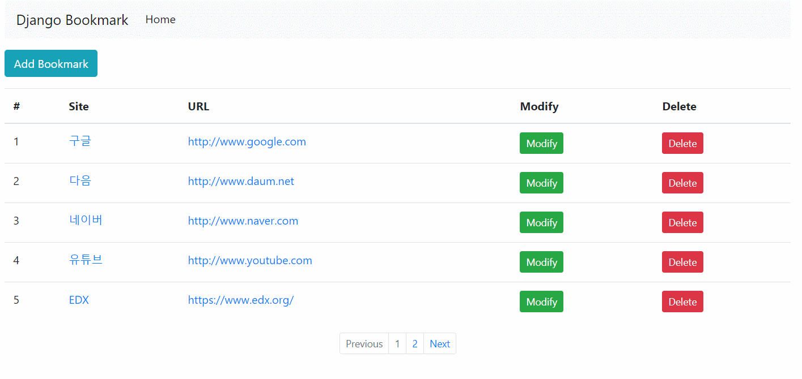

## Django - Bookmark

- 북마크(인터넷 즐겨찾기) 서비스 입니다.(CRUD 구현 목적)  

### URL 구조

- /bookmark/ : 북마크 목록 페이지  
- /bookmark/add : 북마크 추가  
- /bookmark/detail/[int] : 북마크 상세  
- /bookmark/update/[int] : 북마크 수정  
- /bookmark/delete/[int] : 북마크 삭제  

  


### 프로젝트 구조  

```
│  db.sqlite3
│  manage.py
│
├─bookmark
│  │  admin.py : 관리자 페이지 설정
│  │  apps.py
│  │  models.py : DB에 저장할 테이블 및 필드 정의
│  │  tests.py
│  │  urls.py : 앱에서 구현된 페이지와 url 매핑 선언
│  │  views.py : 각 페이지의 로직 구현
│  │  __init__.py
│  │
│  ├─templates
│  │  └─bookmark : 각 페이지 템플릿 구현
│  │          bookmark_confirm_delete.html
│  │          bookmark_create.html
│  │          bookmark_detail.html
│  │          bookmark_list.html
│  │          bookmark_update.html
│  
│
├─config
│  │  settings.py : 프로젝트 설정 파일
│  │  urls.py : 프로젝트의 모든 url 매핑 선언
│  │  wsgi.py
│  │  __init__.py
│  
├─static
│      style.css
│
└─templates
        base.html : 모든 템플릿에 적용가능한 뼈대 템플릿
```

### Reference

- 배프의 오지랖 파이썬 웹 프로그래밍