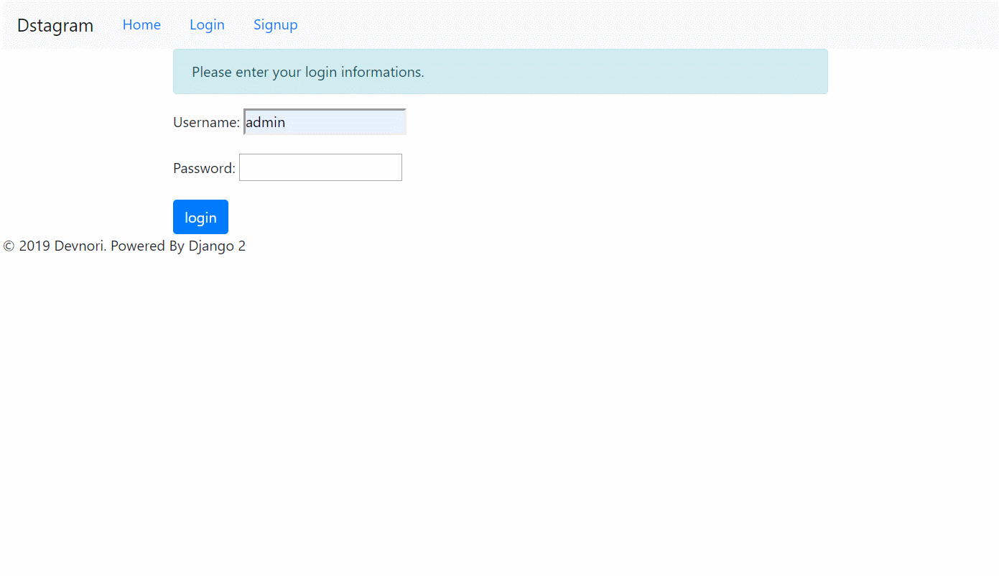

## Django - Dstagram

- 인스타그램 카피 프로젝트 입니다.  
  - CRUD 구현 및 이미지 파일에 관한 설정, 서버 셋팅에 중점을 뒀습니다.    


### 시연 화면

  


### 앱(app) 설명

- `photo` : 사진에 대한 CRUD가 구현된 앱 입니다.  
  - 상세 페이지에 댓글 시스템(DISQUS)이 추가로 구현되어 있습니다.  

- `accounts` : 회원 가입 및 인증이 구현된 앱 입니다.  


### 프로젝트 구조  

```
│  .gitignore : 헤로쿠(Heroku) 배포 시, 제외할 파일 목록 지정
│  db.sqlite3
│  local_to_s3upload.py
│  manage.py
│  Procfile : 헤로쿠(Heroku)에서 웹 서비스를 시작할 때 사용할 명령어 설정
│  README.md
│  requirements.txt : 프로젝트에 사용된 모듈 목록
│  runtime.txt : 헤로쿠(Heroku) 배포 시, 사용할 파이썬 버전 명시
│
├─.config_secret : 중요 정보를 분리 저장할 숨김 폴더
│      settings_common.json 
│
├─accounts : 회원가입 및 인증 앱
│  │  admin.py
│  │  apps.py
│  │  forms.py
│  │  models.py
│  │  tests.py
│  │  urls.py
│  │  views.py
│  │  __init__.py
│  │
│  ├─migrations
│  │  │  __init__.py
│  │
│  ├─templates
│  │  └─registration
│  │          login.html
│  │          logout.html
│  │          register.html
│  │          register_done.html
│
├─config : 프로젝트 관리 폴더
│  │  asset_storage.py : AWS S3 연동에 사용되는 클래스
│  │  settings.py
│  │  urls.py
│  │  wsgi.py
│  │  __init__.py
│
├─media : 업로드한 파일이 저장되는 폴더
│  └─photos
│      └─2019
│          └─04
│              └─08
│                      django_logo.png
│                      python_logo.jpeg
│
├─photo : 사진 업로드 및 CRUD 구현 앱(+댓글)
│  │  admin.py
│  │  apps.py
│  │  models.py
│  │  tests.py
│  │  urls.py
│  │  views.py
│  │  __init__.py
│  │
│  ├─migrations
│  │  │  0001_initial.py
│  │  │  __init__.py
│  │
│  ├─templates
│  │  └─photo
│  │          delete.html
│  │          detail.html
│  │          list.html
│  │          update.html
│  │          upload.html
│
└─templates
        base.html : 모든 템플릿에서 사용할 뼈대 템플릿
```

### Reference

- 배프의 오지랖 파이썬 웹 프로그래밍